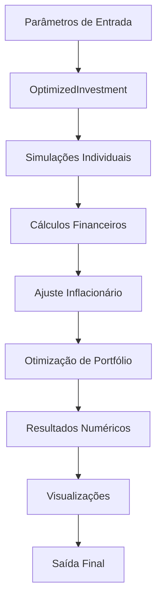

# Documento de Design

## Visão Geral

O Sistema de Simulação e Otimização de Investimentos Imobiliários será implementado como uma aplicação Python modular, utilizando bibliotecas científicas para cálculos financeiros e otimização matemática. O sistema seguirá o padrão de arquitetura em camadas, separando lógica de negócio, visualização e interface de usuário.

## Arquitetura

### Arquitetura em Camadas

```
┌─────────────────────────────────────┐
│           Interface (main.py)       │
├─────────────────────────────────────┤
│        Visualização (visualization) │
├─────────────────────────────────────┤
│         Lógica de Negócio (core)    │
├─────────────────────────────────────┤
│    Bibliotecas (NumPy, SciPy, MPL)  │
└─────────────────────────────────────┘
```

### Fluxo de Dados



## Componentes e Interfaces

### 1. Módulo Core (core.py)

**Classe Principal: OptimizedInvestment**

```python
class OptimizedInvestment:
    def __init__(self, inflacao: float, ir_renda_fixa: float = 15, ir_aluguel: float = 27.5)
    
    # Métodos de Utilidade
    def ajuste_inflacao(self, valor: float, meses: int) -> float
    
    # Simulações de Renda Fixa
    def investimento_cdi(self, aporte_inicial: float, aporte_mensal: float, 
                        taxa_cdi: float, anos: int, imposto_final: bool = False) -> List[float]
    def investimento_ipca(self, aporte_inicial: float, aporte_mensal: float,
                         taxa_ipca: float, anos: int, imposto_final: bool = False) -> List[float]
    
    # Simulações Imobiliárias
    def compra_financiada_planta(self, valor_imovel: float, entrada: float,
                                parcelas: int, taxa_juros: float, valorizacao: float,
                                aluguel: float, anos_construcao: int = 3) -> List[float]
    def compra_financiada_pronto(self, valor_imovel: float, entrada: float,
                                parcelas: int, taxa_juros: float, valorizacao: float,
                                aluguel: float) -> List[float]
    
    # Estratégia Mista
    def compra_e_renda_fixa(self, valor_imovel: float, entrada: float, parcelas: int,
                           taxa_juros: float, taxa_cdi: float, aporte_mensal: float,
                           valorizacao: float) -> List[float]
    
    # Otimização
    def otimizar_portfolio(self, estrategias: Dict[str, List[float]], anos: int,
                          optimize_aportes: bool = False, 
                          aporte_bounds: Tuple = None) -> Tuple[np.ndarray, float, float, float]
```

### 2. Módulo de Visualização (visualization.py)

**Funções de Plotagem:**

```python
def plotar_historico_planta_pronto(historico_planta: List[float], 
                                  historico_pronto: List[float], 
                                  meses: int) -> None

def plotar_cenarios(cenarios: Dict[str, List[float]], 
                   anos: int, 
                   pesos_otimizados: np.ndarray = None) -> None
```

### 3. Módulo Principal (main.py)

**Função de Execução:**
- Configuração de parâmetros
- Execução de simulações
- Chamada de otimização
- Geração de relatórios

## Modelos de Dados

### Parâmetros de Configuração

```python
@dataclass
class ConfiguracaoSimulacao:
    inflacao_anual: float
    ir_renda_fixa: float
    ir_aluguel: float
    anos: int
    aporte_inicial: float
    aporte_mensal: float
    taxa_cdi: float
    taxa_ipca: float
```

### Parâmetros Imobiliários

```python
@dataclass
class ParametrosImovel:
    valor_imovel: float
    entrada_imovel: float
    taxa_juros_financiamento: float
    valorizacao_imovel: float
    aluguel_mensal: float
    anos_construcao: int
```

### Resultado de Otimização

```python
@dataclass
class ResultadoOtimizacao:
    pesos_otimizados: np.ndarray
    aporte_inicial_otimo: Optional[float]
    aporte_mensal_otimo: Optional[float]
    retorno_final: float
    sucesso: bool
```

## Tratamento de Erros

### Estratégia de Tratamento

1. **Validação de Entrada**: Verificar parâmetros antes dos cálculos
2. **Tratamento de Otimização**: Capturar falhas na otimização matemática
3. **Logging**: Registrar erros para debugging
4. **Fallback**: Fornecer resultados parciais quando possível

### Tipos de Erro

```python
class SimulacaoError(Exception):
    """Erro base para simulações"""
    pass

class OtimizacaoError(SimulacaoError):
    """Erro específico de otimização"""
    pass

class ParametroInvalidoError(SimulacaoError):
    """Erro de parâmetro inválido"""
    pass
```

## Estratégia de Testes

### Testes Unitários

1. **Testes de Cálculo Financeiro**:
   - Validar fórmulas de juros compostos
   - Verificar cálculos de impostos
   - Testar ajuste inflacionário

2. **Testes de Simulação**:
   - Cenários conhecidos com resultados esperados
   - Casos extremos (taxas zero, valores altos)
   - Consistência entre diferentes estratégias

3. **Testes de Otimização**:
   - Convergência em casos simples
   - Tratamento de restrições
   - Validação de bounds

### Testes de Integração

1. **Fluxo Completo**: Da entrada à saída final
2. **Geração de Gráficos**: Verificar criação de arquivos
3. **Consistência de Dados**: Entre módulos

## Considerações de Performance

### Otimizações Implementadas

1. **Operações Vetorizadas**: Uso de NumPy para cálculos em lote
2. **Pré-cálculo**: Taxas mensais calculadas uma vez
3. **Algoritmo de Otimização**: SLSQP para convergência eficiente
4. **Memória**: Listas ao invés de arrays para históricos longos

### Limitações de Escala

- **Horizonte Temporal**: Otimizado para até 30 anos (360 meses)
- **Número de Estratégias**: Suporta até 10 estratégias simultâneas
- **Precisão**: Float64 para cálculos financeiros

## Dependências Externas

### Bibliotecas Principais

```python
numpy>=1.21.0          # Cálculos numéricos
scipy>=1.7.0           # Otimização matemática
matplotlib>=3.4.0      # Visualizações
```

### Justificativas

- **NumPy**: Performance em operações matemáticas
- **SciPy**: Algoritmos de otimização robustos
- **Matplotlib**: Visualizações profissionais e customizáveis

## Configuração e Deployment

### Estrutura de Arquivos

```
simulacao-investimentos-imobiliarios/
├── core.py                    # Lógica principal
├── visualization.py           # Gráficos e visualizações
├── main.py                   # Script de execução
├── requirements.txt          # Dependências
└── outputs/                  # Gráficos gerados
    ├── comparacao_imoveis.jpg
    └── cenarios_investimento.jpg
```

### Instalação

```bash
pip install -r requirements.txt
python main.py
```

## Extensibilidade

### Pontos de Extensão

1. **Novas Estratégias**: Interface comum para adicionar investimentos
2. **Algoritmos de Otimização**: Pluggable optimization backends
3. **Formatos de Saída**: JSON, CSV, PDF reports
4. **Visualizações**: Novos tipos de gráficos

### Padrões de Design

- **Strategy Pattern**: Para diferentes tipos de investimento
- **Factory Pattern**: Para criação de simuladores
- **Observer Pattern**: Para notificações de progresso