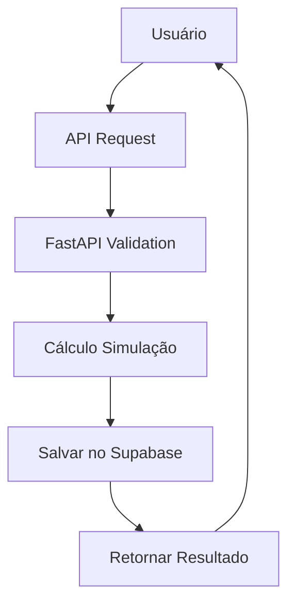
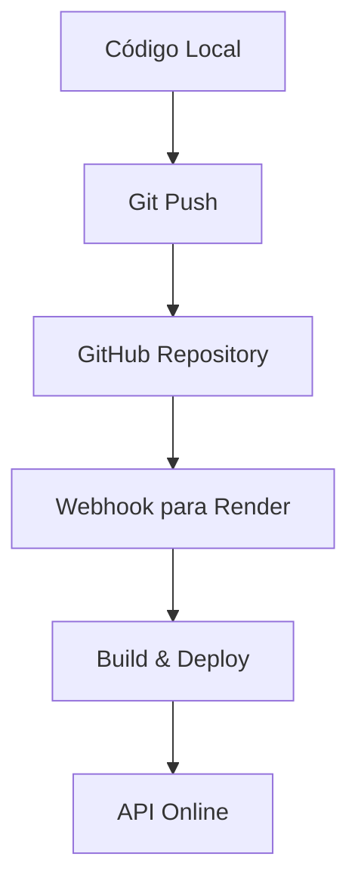

# 🏗️ Arquitetura do Investment Simulation System

## 📊 Visão Geral da Arquitetura

```
┌─────────────────┐    ┌─────────────────┐    ┌─────────────────┐    ┌─────────────────┐
│                 │    │                 │    │                 │    │                 │
│    GitHub       │───▶│     Render      │───▶│   FastAPI       │───▶│   Supabase      │
│   (Código)      │    │   (Deploy)      │    │   (Backend)     │    │  (Database)     │
│                 │    │                 │    │                 │    │                 │
└─────────────────┘    └─────────────────┘    └─────────────────┘    └─────────────────┘
        │                        │                        │                        │
        │                        │                        │                        │
        ▼                        ▼                        ▼                        ▼
   Repositório              Deploy Automático         API REST              Dados Persistidos
   Versionamento            CI/CD Pipeline           Simulações             Histórico
   Colaboração              Logs & Monitoring        Documentação           Analytics
```

## 🔄 Fluxo de Funcionamento

### 1. **Desenvolvimento (GitHub)**
```
Desenvolvedor → Código → Git Push → GitHub Repository
```

### 2. **Deploy Automático (Render)**
```
GitHub Push → Webhook → Render Build → Deploy → URL Pública
```

### 3. **Execução (FastAPI + Supabase)**
```
Usuário → API Request → FastAPI → Cálculos → Supabase → Response
```

## 🔧 Componentes Detalhados

### GitHub (Repositório de Código)
**Função:** Versionamento e colaboração
- ✅ Código fonte versionado
- ✅ Histórico de mudanças
- ✅ Colaboração em equipe
- ✅ Issues e documentação
- ✅ Webhooks para deploy automático

### Render (Plataforma de Deploy)
**Função:** Hospedagem e execução da API
- ✅ Deploy automático do GitHub
- ✅ HTTPS gratuito
- ✅ Escalabilidade automática
- ✅ Logs em tempo real
- ✅ Monitoramento de saúde

### FastAPI (Backend/API)
**Função:** Lógica de negócio e API REST
- ✅ Endpoints para simulações
- ✅ Validação de dados (Pydantic)
- ✅ Documentação automática
- ✅ Autenticação (se necessário)
- ✅ Integração com Supabase

### Supabase (Banco de Dados)
**Função:** Persistência de dados
- ✅ PostgreSQL gerenciado
- ✅ API REST automática
- ✅ Autenticação integrada
- ✅ Real-time subscriptions
- ✅ Dashboard administrativo

## 📱 Como o Usuário Vai Usar

### Cenário 1: API Direta
```
1. Usuário faz requisição HTTP
2. Render recebe a requisição
3. FastAPI processa a simulação
4. Dados são salvos no Supabase
5. Resultado é retornado ao usuário
```

### Cenário 2: Frontend Web (Futuro)
```
1. Usuário acessa interface web
2. Frontend faz chamadas para API
3. API processa no Render
4. Dados persistidos no Supabase
5. Interface atualizada em tempo real
```

## 🔗 Integrações Específicas

### GitHub ↔ Render
```yaml
# Configuração automática
- Push para branch main → Deploy automático
- Pull Request → Preview deploy
- Logs de build disponíveis
- Rollback automático em caso de erro
```

### FastAPI ↔ Supabase
```python
# Exemplo de integração
from supabase import create_client

supabase = create_client(
    url="https://seu-projeto.supabase.co",
    key="sua-chave-publica"
)

# Salvar simulação
result = supabase.table('simulations').insert({
    'user_id': user_id,
    'strategy': 'CDI',
    'parameters': parameters,
    'result': calculation_result
}).execute()
```

### Render ↔ Supabase
```bash
# Variáveis de ambiente no Render
SUPABASE_URL=https://seu-projeto.supabase.co
SUPABASE_KEY=sua-chave-publica
DATABASE_URL=postgresql://...
```

## 💾 Estrutura do Banco de Dados (Supabase)

### Tabelas Principais

#### 1. **users** (Usuários)
```sql
CREATE TABLE users (
    id UUID PRIMARY KEY DEFAULT gen_random_uuid(),
    email VARCHAR UNIQUE NOT NULL,
    name VARCHAR,
    created_at TIMESTAMP DEFAULT NOW()
);
```

#### 2. **simulations** (Simulações)
```sql
CREATE TABLE simulations (
    id UUID PRIMARY KEY DEFAULT gen_random_uuid(),
    user_id UUID REFERENCES users(id),
    strategy VARCHAR NOT NULL,
    parameters JSONB NOT NULL,
    result JSONB NOT NULL,
    created_at TIMESTAMP DEFAULT NOW()
);
```

#### 3. **portfolios** (Portfólios Otimizados)
```sql
CREATE TABLE portfolios (
    id UUID PRIMARY KEY DEFAULT gen_random_uuid(),
    user_id UUID REFERENCES users(id),
    name VARCHAR NOT NULL,
    strategies JSONB NOT NULL,
    optimal_weights JSONB NOT NULL,
    final_return DECIMAL,
    created_at TIMESTAMP DEFAULT NOW()
);
```

## 🔄 Fluxos de Dados

### Fluxo de Simulação


### Fluxo de Deploy


## 🔒 Segurança e Autenticação

### Autenticação com Supabase
```python
# Middleware de autenticação
@app.middleware("http")
async def auth_middleware(request: Request, call_next):
    token = request.headers.get("Authorization")
    if token:
        user = supabase.auth.get_user(token)
        request.state.user = user
    response = await call_next(request)
    return response
```

### Variáveis de Ambiente Seguras
```bash
# No Render
SUPABASE_URL=https://xxx.supabase.co
SUPABASE_ANON_KEY=eyJ... (chave pública)
SUPABASE_SERVICE_KEY=eyJ... (chave privada - apenas backend)
JWT_SECRET=sua-chave-jwt
```

## 📊 Monitoramento e Analytics

### Logs no Render
- Logs de aplicação em tempo real
- Métricas de performance
- Alertas de erro automáticos

### Analytics no Supabase
```sql
-- Simulações mais populares
SELECT strategy, COUNT(*) as usage_count
FROM simulations
GROUP BY strategy
ORDER BY usage_count DESC;

-- Usuários mais ativos
SELECT user_id, COUNT(*) as simulations_count
FROM simulations
GROUP BY user_id
ORDER BY simulations_count DESC;
```

## 🚀 Escalabilidade

### Render (Backend)
- Auto-scaling baseado em demanda
- Load balancing automático
- CDN global para assets estáticos

### Supabase (Database)
- PostgreSQL otimizado
- Connection pooling
- Read replicas automáticas
- Backup automático

## 💰 Custos Estimados

### Desenvolvimento/Teste (Gratuito)
```
GitHub: Gratuito (repositórios públicos)
Render: 750 horas/mês gratuitas
Supabase: 500MB database + 2GB bandwidth
Total: R$ 0/mês
```

### Produção (Baixo Volume)
```
GitHub: Gratuito
Render: $7/mês (sempre ativo)
Supabase: $25/mês (Pro plan)
Total: ~R$ 160/mês
```

## 🔧 Configuração Passo a Passo

### 1. Configurar Supabase
```bash
# 1. Criar projeto no Supabase
# 2. Copiar URL e chaves
# 3. Criar tabelas necessárias
# 4. Configurar RLS (Row Level Security)
```

### 2. Configurar Render
```bash
# 1. Conectar repositório GitHub
# 2. Adicionar variáveis de ambiente
# 3. Configurar build commands
# 4. Deploy automático
```

### 3. Testar Integração
```python
# Script de teste
import requests

# Testar API
response = requests.get("https://seu-app.onrender.com/")
print(f"API Status: {response.status_code}")

# Testar simulação
simulation_data = {
    "aporte_inicial": 100000,
    "aporte_mensal": 3000,
    "taxa_cdi": 10.5,
    "anos": 20
}

response = requests.post(
    "https://seu-app.onrender.com/simulate/cdi",
    json=simulation_data
)
print(f"Simulação: {response.json()}")
```

## 🎯 Benefícios da Arquitetura

### Para Desenvolvedores
- ✅ Deploy automático
- ✅ Versionamento completo
- ✅ Logs centralizados
- ✅ Rollback fácil
- ✅ Colaboração simplificada

### Para Usuários
- ✅ API sempre disponível
- ✅ Performance otimizada
- ✅ Dados seguros
- ✅ Histórico de simulações
- ✅ Acesso global

### Para o Negócio
- ✅ Custos previsíveis
- ✅ Escalabilidade automática
- ✅ Backup automático
- ✅ Analytics integrados
- ✅ Manutenção mínima

## 🔮 Próximos Passos

1. **Configurar Supabase** (banco de dados)
2. **Integrar autenticação** (opcional)
3. **Adicionar persistência** de simulações
4. **Criar dashboard** de analytics
5. **Desenvolver frontend** React
6. **Implementar cache** Redis
7. **Adicionar testes** automatizados
8. **Configurar CI/CD** avançado

---

**Esta arquitetura oferece uma base sólida, escalável e moderna para o Investment Simulation System! 🚀📈**